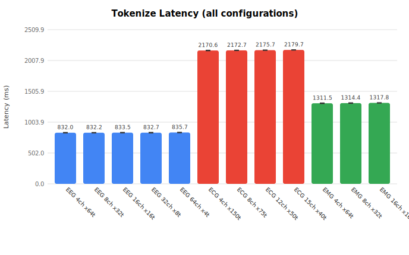
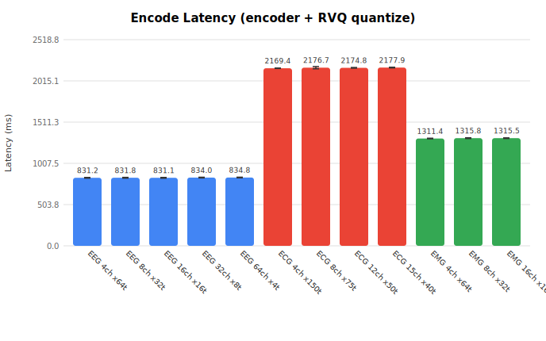
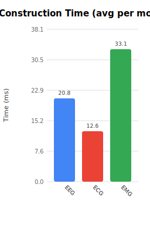
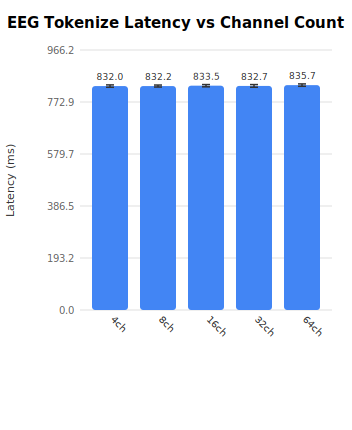
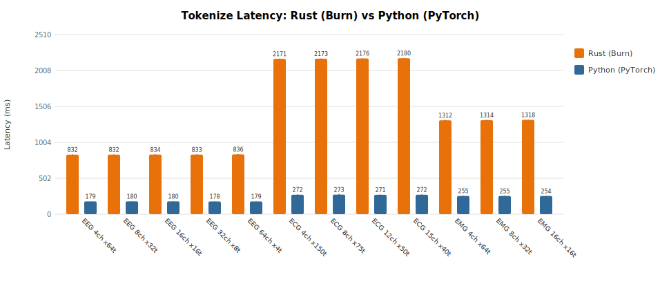
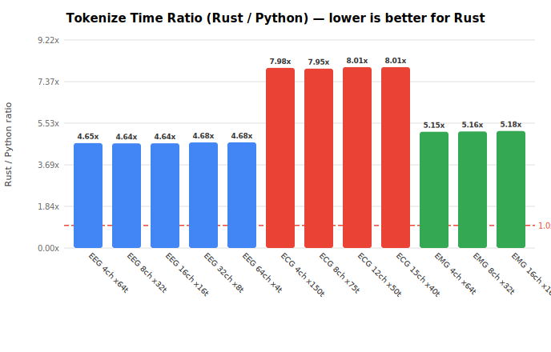

# neurorvq-rs

[](LICENSE)
[](https://www.rust-lang.org)
[](https://burn.dev)

Pure-Rust inference for the [NeuroRVQ](https://github.com/KonstantinosBarmpas/NeuroRVQ) multi-scale biosignal tokenizer, built on [Burn 0.20](https://burn.dev).

NeuroRVQ tokenizes raw **EEG**, **ECG**, and **EMG** signals into discrete neural tokens using a multi-scale temporal encoder and Residual Vector Quantization (RVQ).

## Features

- **Full parity** with the Python reference for all three modalities (EEG, ECG, EMG)
- **Tokenizer pipeline**: encoder → encode heads → RVQ → decoder → decode heads → iFFT reconstruction
- **Standalone Foundation Model** encoder for fine-tuning workflows
- **Zero Python dependencies** — loads upstream YAML configs and safetensors weights directly
- **CPU** (NdArray + Rayon / Apple Accelerate) and **GPU** (wgpu — Metal / Vulkan) backends
- **CLI** with per-parameter overrides on top of YAML configs

## Architecture

```
Raw Signal [B, N, T]
    │
    ▼
┌─────────────────────────────────────┐
│  Multi-Scale Temporal Conv (4 branches) │  ← modality-specific kernels
│  EEG/ECG: 21/15/9/5   EMG: 51/17/8/5   │
└─────────────────────────────────────┘
    │ ×4 branches
    ▼
┌───────────────────────┐
│  Transformer Encoder  │  12 blocks, 10 heads, embed_dim=200
│  (spatial + temporal   │
│   positional embeds)   │
└───────────────────────┘
    │ ×4 branches
    ▼
┌───────────────────────┐
│  Encode Heads         │  Linear → Tanh → Linear (→ code_dim)
└───────────────────────┘
    │ ×4 branches
    ▼
┌───────────────────────┐
│  Residual VQ          │  8 levels (EEG/ECG) or 16 levels (EMG)
│  (L2-normalized       │  codebook_size=8192, code_dim=128
│   codebook lookup)    │
└───────────────────────┘
    │ ×4 branches           ← Token indices output here
    ▼
┌───────────────────────┐
│  Transformer Decoder  │  3 blocks (PatchEmbed 1×1 conv input)
└───────────────────────┘
    │ concat 4 branches
    ▼
┌───────────────────────┐
│  Decode Heads         │  Amplitude (GELU), Sin/Cos phase (Tanh)
└───────────────────────┘
    │
    ▼
  Inverse FFT → Reconstructed Signal
```

## Supported Modalities

| Modality | Channels | Patch Size | Conv Kernels (G1) | Conv Kernels (G2) | RVQ Levels |
|----------|----------|-----------|-------------------|-------------------|------------|
| **EEG**  | 103      | 200       | 21, 15, 9, 5     | 9, 7, 5, 3       | 8          |
| **ECG**  | 15       | 40        | 21, 15, 9, 5     | 9, 7, 5, 3       | 8          |
| **EMG**  | 16       | 200       | 51, 17, 8, 5     | 25, 9, 4, 3      | 16         |

## Quick Start

### Build

```bash
# CPU (default — NdArray + Rayon)
cargo build --release

# CPU with Apple Accelerate BLAS
cargo build --release --features blas-accelerate

# GPU (Metal on macOS)
cargo build --release --no-default-features --features metal
```

### CLI — Tokenize

```bash
# Auto-detects EEG modality from the YAML filename:
cargo run --release --bin infer -- \
    --config flags/NeuroRVQ_EEG_v1.yml \
    --weights model.safetensors

# Explicit modality + full reconstruction:
cargo run --release --bin infer -- \
    --config flags/NeuroRVQ_ECG_v1.yml \
    --weights model.safetensors \
    --modality ECG \
    --mode forward

# Foundation model encoder:
cargo run --release --bin infer -- \
    --config flags/NeuroRVQ_EEG_v1.yml \
    --weights fm_weights.safetensors \
    --mode fm
```

### CLI — Override Config Parameters

Any YAML value can be overridden from the command line:

```bash
cargo run --release --bin infer -- \
    --config flags/NeuroRVQ_EEG_v1.yml \
    --weights model.safetensors \
    --embed-dim 64 \
    --depth-encoder 6 \
    --depth-decoder 2 \
    --n-code 4096
```

Run `--help` for all available flags.

### Library API

```rust
use neurorvq_rs::{NeuroRVQEncoder, Modality, data, channels};
use std::path::Path;

// Load tokenizer (modality auto-detected from YAML filename)
let (model, load_ms) = NeuroRVQEncoder::<B>::load(
    Path::new("flags/NeuroRVQ_EEG_v1.yml"),
    Path::new("model.safetensors"),
    device,
)?;

// Build input batch
let batch = data::build_batch_with_modality(
    signal_data,
    &channel_names,
    n_time, model.config.n_patches,
    n_channels, n_samples,
    Modality::EEG, &device,
);

// Tokenize → 4 branches × 8 RVQ levels of token indices
let tokens = model.tokenize(&batch)?;

// Full forward: encode → quantize → decode → iFFT → standardized signals
let result = model.forward(&batch)?;
// result.original_std, result.reconstructed_std
```

### Foundation Model API

```rust
use neurorvq_rs::{NeuroRVQFoundationModel, Modality};

let (fm, _ms) = NeuroRVQFoundationModel::<B>::load(
    Path::new("flags/NeuroRVQ_EEG_v1.yml"),
    Path::new("fm_weights.safetensors"),
    Modality::EEG,
    device,
)?;

// 4 branch feature vectors
let features = fm.encode(&batch)?;

// Mean-pooled representation for classification
let pooled = fm.encode_pooled(&batch)?;
```

### Config Overrides (Library)

```rust
use neurorvq_rs::{NeuroRVQEncoder, ConfigOverrides, Modality};

let overrides = ConfigOverrides {
    embed_dim: Some(64),
    depth_encoder: Some(6),
    ..Default::default()
};

let (model, _ms) = NeuroRVQEncoder::<B>::load_full(
    Path::new("flags/NeuroRVQ_EEG_v1.yml"),
    Path::new("model.safetensors"),
    Modality::EEG,
    Some(&overrides),
    device,
)?;
```

## Weight Conversion

NeuroRVQ ships `.pt` (PyTorch pickle) weights. Convert to safetensors:

```python
import torch
from safetensors.torch import save_file

state_dict = torch.load("model.pt", map_location="cpu")
# Flatten nested state dicts if needed
save_file(state_dict, "model.safetensors")
```

## Benchmarks

**Platform:** Apple M4 Pro, 64 GB RAM, macOS (arm64)
**Backend:** NdArray + Rayon (CPU, multi-threaded)

| Configuration | Modality | Channels | Patches | Construct (ms) | Encode (ms) | Tokenize (ms) |
|---|---|---:|---:|---:|---:|---:|
| EEG 4ch ×64t | EEG | 4 | 64 | 60 | 831.2 ± 4.3 | 832.0 ± 4.4 |
| EEG 8ch ×32t | EEG | 8 | 32 | 12 | 831.8 ± 4.6 | 832.2 ± 3.7 |
| EEG 16ch ×16t | EEG | 16 | 16 | 12 | 831.1 ± 4.6 | 833.5 ± 4.2 |
| EEG 32ch ×8t | EEG | 32 | 8 | 12 | 834.0 ± 4.2 | 832.7 ± 5.0 |
| EEG 64ch ×4t | EEG | 64 | 4 | 12 | 834.8 ± 4.0 | 835.7 ± 4.4 |
| ECG 4ch ×150t | ECG | 4 | 150 | 11 | 2169.4 ± 2.4 | 2170.6 ± 4.4 |
| ECG 8ch ×75t | ECG | 8 | 75 | 11 | 2176.7 ± 13.6 | 2172.7 ± 3.5 |
| ECG 12ch ×50t | ECG | 12 | 50 | 12 | 2174.8 ± 4.0 | 2175.7 ± 3.2 |
| ECG 15ch ×40t | ECG | 15 | 40 | 13 | 2177.9 ± 4.1 | 2179.7 ± 2.8 |
| EMG 4ch ×64t | EMG | 4 | 64 | 64 | 1311.4 ± 3.4 | 1311.5 ± 5.2 |
| EMG 8ch ×32t | EMG | 8 | 32 | 25 | 1315.8 ± 4.7 | 1314.4 ± 4.9 |
| EMG 16ch ×16t | EMG | 16 | 16 | 25 | 1315.5 ± 3.7 | 1317.8 ± 3.5 |

### Tokenize Latency



### Encode Latency



### Model Construction Time



### EEG Scaling by Channel Count



### Key Observations

- **EEG** tokenization runs at ~**833 ms** per sample (256 total patches, 12-layer encoder + 3-layer decoder, 200-dim), largely independent of channel/time decomposition
- **ECG** is ~**2.6× slower** due to 600 total patches (vs 256) despite smaller embed_dim (40)
- **EMG** is ~**1.6× slower** than EEG due to 16 RVQ quantizer levels (vs 8) and larger conv kernels
- **Construction time** is ~12 ms for subsequent models (60 ms cold start for the first)
- **Latency is dominated by the transformer** — the total patch count is the primary scaling factor, not channel vs time decomposition
- Standard deviation is consistently **< 1%** of the mean, indicating stable performance

## Rust vs Python Comparison

**Python:** PyTorch 2.8.0 (CPU) — same platform (Apple M4 Pro)

| Configuration | Modality | Rust (ms) | Python (ms) | Ratio (Rust/Py) |
|---|---|---:|---:|---:|
| EEG 4ch ×64t | EEG | 832.0 ± 4.4 | 179.0 ± 3.0 | 4.6x |
| EEG 16ch ×16t | EEG | 833.5 ± 4.2 | 179.7 ± 3.1 | 4.6x |
| EEG 64ch ×4t | EEG | 835.7 ± 4.4 | 178.5 ± 2.8 | 4.7x |
| ECG 4ch ×150t | ECG | 2170.6 ± 4.4 | 272.0 ± 5.6 | 8.0x |
| ECG 15ch ×40t | ECG | 2179.7 ± 2.8 | 272.0 ± 4.6 | 8.0x |
| EMG 4ch ×64t | EMG | 1311.5 ± 5.2 | 254.7 ± 4.6 | 5.1x |
| EMG 16ch ×16t | EMG | 1317.8 ± 3.5 | 254.2 ± 4.0 | 5.2x |

### Tokenize Latency: Rust vs Python



### Time Ratio (Rust / Python)



### Why Python is faster (for now)

PyTorch 2.8 on Apple Silicon uses highly optimized **Apple Accelerate / AMX** BLAS kernels and **MPS-level fused operators** for matrix multiplication, attention, and layer normalization. The Rust Burn `NdArray` backend uses generic Rayon-parallelized BLAS without hardware-specific fused kernels.

**Expected improvements:**
- `--features blas-accelerate` — enables Apple Accelerate BLAS for NdArray (significant speedup on Apple Silicon)
- `--features metal` — wgpu Metal backend with GPU compute shaders
- Burn’s ongoing GEMM / fused-attention optimizations
- The Rust implementation has **zero Python overhead**, no GIL, and can be embedded in real-time pipelines, mobile apps, and edge devices where PyTorch is unavailable

### Re-run Benchmarks

```bash
# Rust only
cargo run --release --bin bench

# Python only
python3 scripts/bench_python.py

# Generate comparison charts
python3 scripts/compare_benchmarks.py
```

Results are written to `figures/`.

## Project Structure

```
src/
├── lib.rs                  # Public API re-exports
├── config.rs               # YAML config parser + ConfigOverrides
├── channels.rs             # EEG/ECG/EMG channel vocabularies
├── data.rs                 # Input batch construction
├── encoder.rs              # High-level NeuroRVQEncoder + FoundationModel
├── weights.rs              # Safetensors weight loading
├── model/
│   ├── foundation.rs       # NeuroRVQFM (encoder/decoder transformer)
│   ├── tokenizer.rs        # Full tokenizer pipeline with FFT/iFFT
│   ├── multi_scale_conv.rs # Modality-specific inception-style convolutions
│   ├── attention.rs        # Multi-head attention with QKV bias + QK norm
│   ├── encoder_block.rs    # Pre-norm transformer block with layer scale
│   ├── feedforward.rs      # MLP (GELU activation)
│   ├── norm.rs             # LayerNorm wrapper
│   ├── patch_embed.rs      # 1×1 Conv2d decoder patch embedding
│   ├── quantizer.rs        # L2-normalized vector quantizer
│   └── rvq.rs              # Residual Vector Quantization
├── bin/
│   ├── infer.rs            # CLI for tokenization / reconstruction
│   └── bench.rs            # Benchmark suite
flags/
├── NeuroRVQ_EEG_v1.yml    # Upstream EEG config
├── NeuroRVQ_ECG_v1.yml    # Upstream ECG config
└── NeuroRVQ_EMG_v1.yml    # Upstream EMG config
```

## License

Apache-2.0

## References

- [NeuroRVQ: Joint Neurophysiological Multi-Scale Temporal Tokenization and Reconstruction](https://github.com/KonstantinosBarmpas/NeuroRVQ)
- [Burn ML Framework](https://burn.dev)
