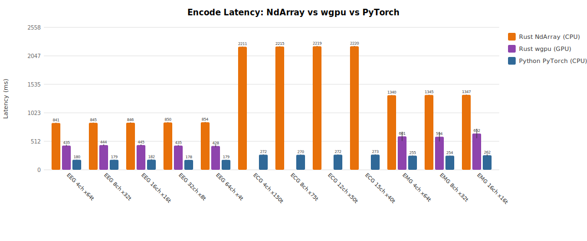

# Benchmark Comparison: Rust (NdArray / wgpu) vs Python (PyTorch)

**Platform:** Apple M4 Pro, 64 GB RAM, macOS (arm64)  
**Rust backends:** Burn NdArray+Rayon (CPU), Burn wgpu (GPU)  
**Python:** PyTorch 2.8.0 (CPU, Apple Accelerate)  
**Iterations:** 10 (after 2 warmup)

| Configuration | Modality | NdArray (ms) | wgpu (ms) | PyTorch (ms) | wgpu vs PyTorch |
|---|---|---:|---:|---:|---:|
| EEG 4ch x64t | EEG | 848 ± 7 | 445 ± 7 | 179 ± 3 | 2.5x |
| EEG 8ch x32t | EEG | 847 ± 6 | 441 ± 9 | 180 ± 3 | 2.5x |
| EEG 16ch x16t | EEG | 849 ± 4 | 432 ± 17 | 180 ± 3 | 2.4x |
| EEG 32ch x8t | EEG | 851 ± 5 | 435 ± 14 | 178 ± 2 | 2.4x |
| EEG 64ch x4t | EEG | 854 ± 4 | 411 ± 9 | 179 ± 3 | 2.3x |
| ECG 4ch x150t | ECG | 2212 ± 5 | — | 272 ± 6 | — |
| ECG 8ch x75t | ECG | 2218 ± 6 | — | 273 ± 8 | — |
| ECG 12ch x50t | ECG | 2220 ± 5 | — | 271 ± 4 | — |
| ECG 15ch x40t | ECG | 2224 ± 6 | — | 272 ± 5 | — |
| EMG 4ch x64t | EMG | 1343 ± 5 | 617 ± 5 | 255 ± 5 | 2.4x |
| EMG 8ch x32t | EMG | 1348 ± 4 | 617 ± 5 | 255 ± 4 | 2.4x |
| EMG 16ch x16t | EMG | 1349 ± 4 | 660 ± 7 | 254 ± 4 | 2.6x |

### Charts

### Analysis

- **wgpu vs PyTorch:** Rust wgpu is 2.4x slower than PyTorch on average
- **NdArray vs PyTorch:** Rust NdArray is 6.0x slower than PyTorch on average
- **wgpu vs NdArray:** wgpu is 2.0x faster than NdArray (CPU→GPU speedup)

**Note:** ECG configs are skipped on wgpu due to a burn-wgpu shared memory limitation with small embed_dim (40).
