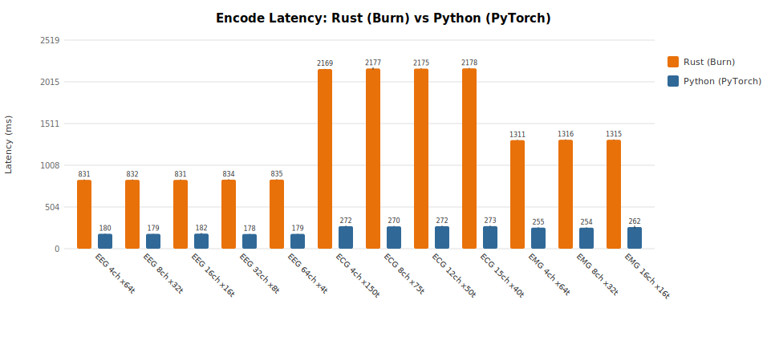

# Rust vs Python Benchmark Comparison

**Platform:** Apple M4 Pro, 64 GB RAM, macOS (arm64)  
**Rust backend:** NdArray + Rayon  
**Python:** PyTorch 2.8.0 (CPU)  
**Iterations:** 10 (after 2 warmup)

| Configuration | Modality | Rust Tokenize (ms) | Python Tokenize (ms) | Ratio (Rust/Py) |
|---|---|---:|---:|---:|
| EEG 4ch x64t | EEG | 832.0 ± 4.4 | 179.0 ± 3.0 | 4.6x |
| EEG 8ch x32t | EEG | 832.2 ± 3.7 | 179.5 ± 3.2 | 4.6x |
| EEG 16ch x16t | EEG | 833.5 ± 4.2 | 179.7 ± 3.1 | 4.6x |
| EEG 32ch x8t | EEG | 832.7 ± 5.0 | 178.1 ± 2.4 | 4.7x |
| EEG 64ch x4t | EEG | 835.7 ± 4.4 | 178.5 ± 2.8 | 4.7x |
| ECG 4ch x150t | ECG | 2170.6 ± 4.4 | 272.0 ± 5.6 | 8.0x |
| ECG 8ch x75t | ECG | 2172.7 ± 3.5 | 273.4 ± 8.2 | 7.9x |
| ECG 12ch x50t | ECG | 2175.7 ± 3.2 | 271.5 ± 4.1 | 8.0x |
| ECG 15ch x40t | ECG | 2179.7 ± 2.8 | 272.0 ± 4.6 | 8.0x |
| EMG 4ch x64t | EMG | 1311.5 ± 5.2 | 254.7 ± 4.6 | 5.1x |
| EMG 8ch x32t | EMG | 1314.4 ± 4.9 | 254.5 ± 3.6 | 5.2x |
| EMG 16ch x16t | EMG | 1317.8 ± 3.5 | 254.2 ± 4.0 | 5.2x |

### Charts

